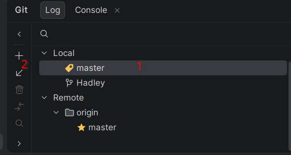

# How to use git collaboratively part 2

## Fetching updates from github

**This is important**

Always do this on the `master` branch first as the master will contain our combined changes.

Your branch is yours and its up to you to manage them no one but you should modify them. 

### Android Studio

1. Make sure to select the master branch
2. Click on this it is called *update selected*

### Commandline

`git pull origin master` this will fetch changes from github and apply them to the master branch. 

**Do not put anything else besides master as it could integrate changes into your branch automatically**

## Integrating changes into your branch

> [!Important] Ensure that there are no modified files in your project that git is tracking
> 
> Either commit all of the files and wait for me (send me a whatsapp about it) to merge them into master or use `git stash` to stash them away
> so that you can get a clean copy of your project.

**Note:** I recommend doing this step in android studio as even I sometimes mess up this step using the command line.

### Android Studio

1. Fetch updates to the master branch first.
2. Ensure that you have checked out your branch.
3. Right-click on the master branch in the git tool and choose `Merge 'master' into 'Hadley'` "Hadley" here is your branch name.
4. If it says you have merged conflicts contact me immediately or if you know how to resolve them you can do that.

