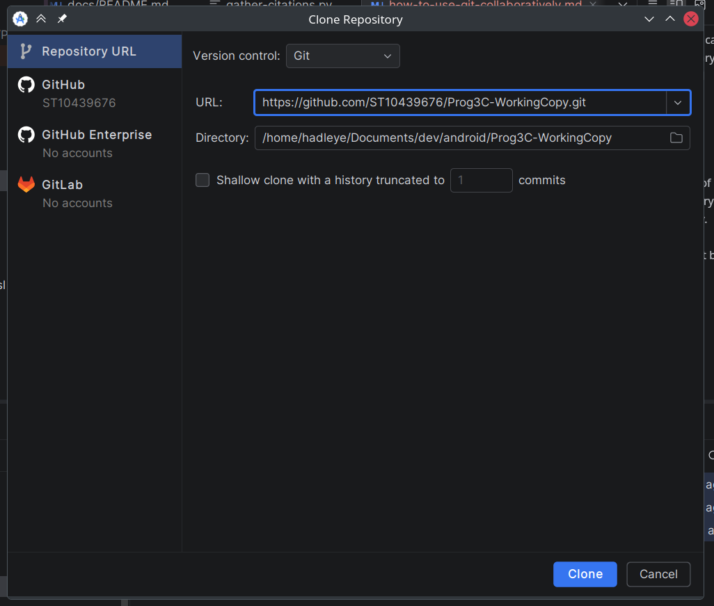
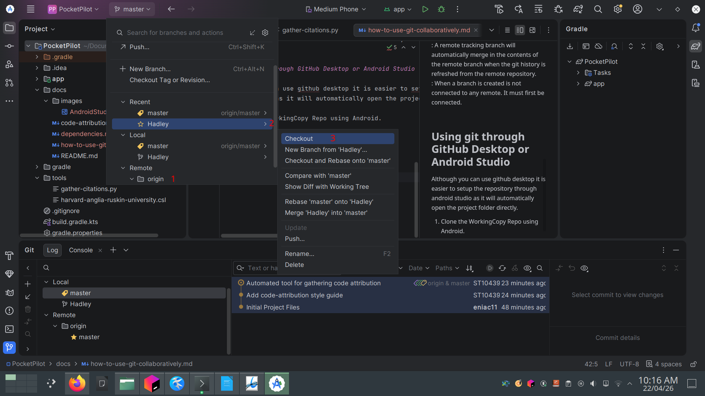
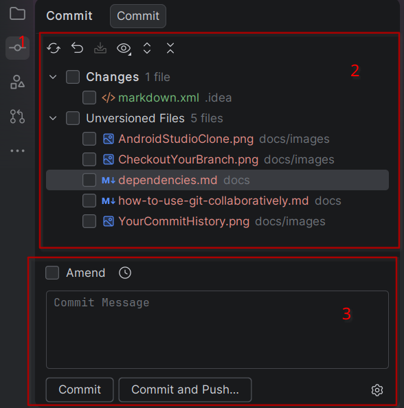
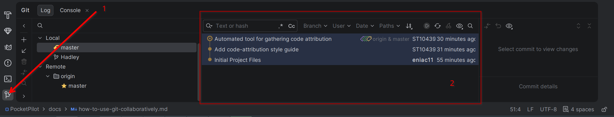

# How to use git collaboratively

## Terminology

*git commit*

: is a record of a collection of files changed.
: A set of commits is contained within a branch.

*git branch*

: A git branch is a line of development. eg. feature-branch-a and feature-branch-b

*git repository*

: A git repository maintains the entire history of your commits.
: A repository can contain many branches.
: A repository is completely independent of github. It must first 
  be linked to github by setting up a remote.
: A repository can contain multiple remotes.
: A repository contains information that links a local branch to a remote branch 
  through a concept called tracking.

*remote tracking branch*

: A remote tracking branch will automatically merge in the contents of the remote branch when 
  the git history is refreshed from the remote repository.  
: When a branch is created is not connected to any remote. It must first be connected.

## Using git through GitHub Desktop or Android Studio

Although you can use github desktop it is easier to setup the repository through
android studio as it will automatically open the project folder directly.

1. Clone the WorkingCopy Repo using Android.

   

2. Switch to your branch.

   
    
   1. Find your branch in the remote section.
   2. Click on the arrow next to your branch name.
   3. Click on checkout

   You can make commits in this branch and when you push changes to github they will appear here.

3. Make commits
    
   

   1. This is where to open the commit tool
   2. You can select files add to the commit
   3. Your commit message, here you can commit or "commit and push" (can be done later)

4. Viewing your commit history

   
   
   1. This is where to open the git integration tool.
   2. This area is where you will find your commit history.

## Using the command line

If you want to use the command line (ie. git bash)

1. Clone the WorkingCopy Repo
    
   Open the command line (git bash) where you store your projects. 
   
   `git clone https://github.com/ST10439676/Prog3C-WorkingCopy`

2. Switch to your branch and track it.

   `git checkout -b Hadley origin/Hadley`
   
   Breaking the command down.
   
   - `git checkout` is used to checkout a remote branch
   - `-b Hadley` is the branch name of the local branch to create in the local repository
   - `origin/Hadley` is called a refspec and git uses it to refer to many things like commits,
      branches, remotes, tags
     - `origin` is the reference used to the remote github repo
     - `/Hadley` is the branch name in the remote (in fact this does not have to match the local branch name at all)

3. Make commits

   - To add files to the staging area: `git add <list-of-files-or-folders>` eg. `git add README.md docs/`
   - To make a commit: `git commit -m <commit-title> -m <commit-message>`
   - Push changes to github:
     
     Depending on the situation there are 2 ways to push your commits
     
     1. `git push Hadley` the simplest it will push all local commits in the local branch called Hadley which tracking the `origin/Hadley` remote.
     2. `git push --set-upstream origin Hadley`: will find a branch in remote origin called `Hadley` and the local branch `Hadley` to track the remote one.    
         use this if you an error that says something about no upstream branches being tracked.

4. Viewing commits

    Use `git log` to view your commit history.